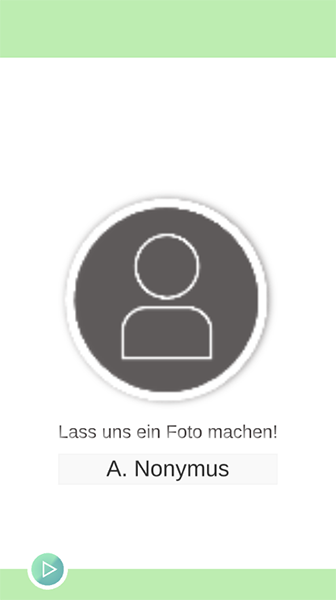
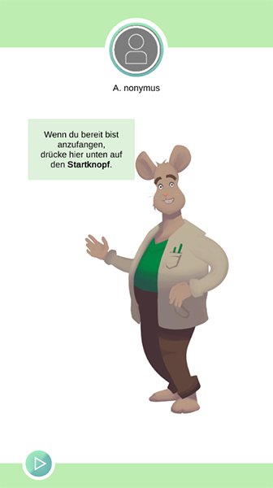
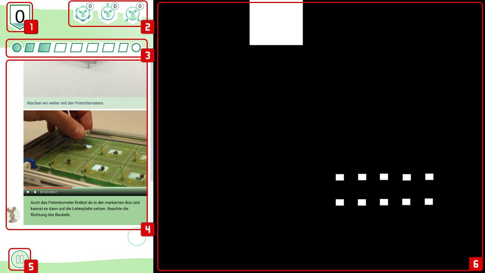
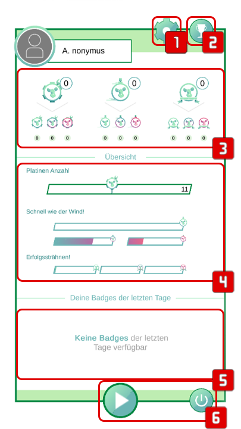
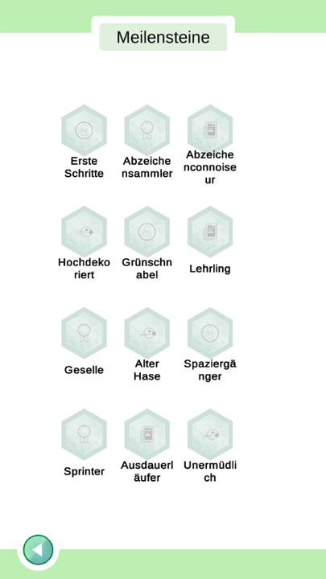
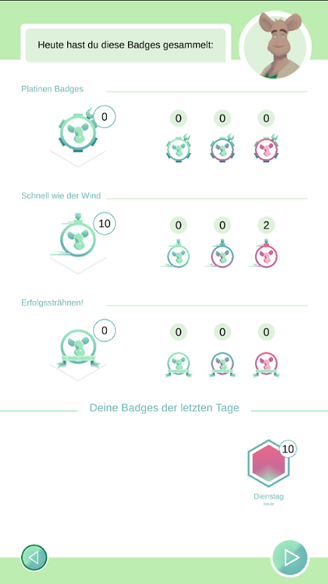
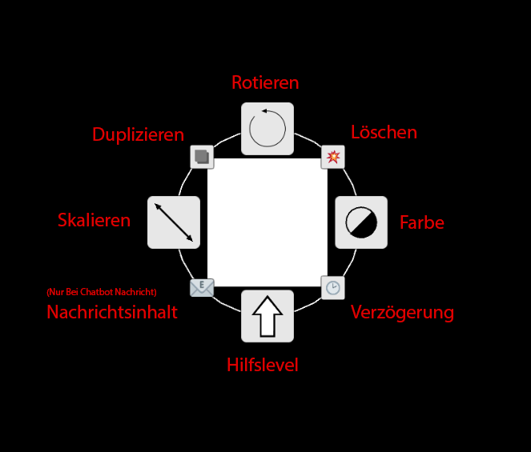

# Anwendungsübersicht
Hier gibt es eine Erklärung der verschiedenen UI - Screens von incluMOVE und deren Funktion.

## Idle Screen
\
Das System startet in den Idle Screen. Wird ein USB Stick eingesteckt, bzw. ist die Nutzung ausgestellt wird entweder auf den Registrierungs Screen oder auf den Begrüßungsscreen weitergeleitet. Nach Beendigung einer Arbeitssession wird wieder auf den Idle Screen zurück geleitet.

## Registrierungs Screen
\
Neue Nutzer werden zur Wahl eines Nutzernamens aufgefordert. In der Mitte ist der Livefeed einer angeschlossenen Webcam zu sehen. Kann die Webcam nicht geladen werden wird ein Platzzhalter verwendet. Nach Bestätigung wird das Bild als Profilbild des Nutzers festgelegt und auf den Begrüßungsscreen weitergeleitet.

## Begrüßungs Screen
\
Bei der Begrüßung werden die vom Nutzer gewählten Belohnungsanimationen abgespielt. Danach wird der Nutzer durch Gregor begrüßt. Durch Drücken auf den Startknopf kann der Nutzer nun den freigeschalteten Workflow starten.

## Workflow Screen
Die Workflowansicht ist die Arbeitsansicht der incluMOVE Software.



###  Durchgangszähler
Hier werden die bsiher fertig abgeschlossenen Montagedurchgänge angezeigt.

###  Abzeichen
Hier werden der Reihe nach die verschiedenen vom Nutzer bisher erreichten Abzeichen für Stückzahlen, Turbodurchläufe und Montageserien angezeigt.

###  Zeitleiste
Hier wird der bisherige Fortschritt unterteilt in die verschiedenen Arbeitsschritte angezigt. Je nach verstrichener Zeit und Orientierungszeit des einzelnen Arbeitsschrittes verfärbt sich die Zeitleiste.

###  Chatoberfläche
Über den Chatbot erhält der Nutzer Infos zum aktuellen Arbeitsschritt, Feedback und Ermutigung.

###  Pausenknopf
Der Pausenknopf hält den Zeitfortschritt an und leitet auf den Pausenbildschirm weiter.

###  Arbeitsfläche
Der restliche Teil der Projektionsfläche ist Arbeitsfläche und wird mittels individualisierbarer Projektionselemente angereichert um zB. einzelne Bauteile, Montageposition, etc. zu markieren.
Klickt der Nutzer hier mit der linken Maustaste wird einen Schritt weiter geschaltet. Klickt er mit der rechten Maustaste wird zurück geschaltet. In incluMOVE Extended ist das manuelle Weiterschalten deaktiviert.

## Pausen Screen


###  Editor
Ist der angemeldete Nutzer ein Administrator wird über diesen Button in den Workflow Editor gewechselt. Andernfalls ist der Button ausgeblendet.

###  Meilensteine
Über diesen Button wird die Meilensteinübersicht geöffnet.

###  Abzeichenzusammenfassung
Hier werden die bisher erreichten Abzeichen genauer aufgeschlüsselt.

###  Abzeichenzusammenfassung
Hier wird der genaue Fortschritt zu den nächsten Abzeichen angezeigt.

###  Arbeitsverlauf
Sofern der Nutzer bereits am System gearbeitet hat werden hier die letzten Arbeitssession angezeigt. Jede Arbeitssession zeigt den Gesamtwert an gesammelten Abzeichen.

###  Workflowsteuerung
Hier kann entweder die Arbeit fortgesetzt oder die Arbeitssession beendet werden.

## Meilenstein Screen
 \
Auf dem Meilenstein Screen kann der Nutzer sehen welche Meilensteine er bereits freigeschaltet hat und welche Belohnungen die Meilensteine freischalten.

## Review Screen
Im Review Screen wird eine Zusammenfassung der Arbeitssession dargestellt.

 \
Im Anschluss an die Übersicht kann der Nutzer seine Belohnung wählen und wird nach Speichern des Profils abgemeldet.
Das System leitet im Anschluss weiter auf den Idle Screen.

## Workflow Editor
Der WorkflowEditor ermöglicht das Editieren der vorhandenen Workflows.


###  Workflow Managment
Hier kann von links nach rechts
- Ein neuer Workflow angelegt werden
- Der aktuelle Workflow abgespeichert werden
- Ein Workflow geöffnet werden
- Der Editor verlassen werden

###  Neuer Arbeitsschritt
Hiermit kann einer neuer Arbeitsschritt hinzugefügt werden.

###  Schrittliste
Hier werden alle Arbeitsschritte in ihrer Ablaufreihenfolge angezeigt. Mit dem Klick auf einen Arbeitsschritt werden alle seine Inhalte auf der Projektionsfläche angezeigt. Auf dem Schritt selbst können die verschiedenen Eigenschaten bearbeitet werden:

#### [Schrittliste - incluMOVE Light](#tab/application-1)
- **Schrittname**\
Die Bezeichnung des Montageschrittes.
- **Schrittdauer**\
Bestimmt die Orientierungsdauer des jeweiligen Arbeitsschrittes für minimales Hilfslevel, normales Hilfslevel und maximales Hilfslevel.
- **Einheitliche Dauer**\
Benutzt die gleiche Dauer für alle Hilfslevel.
- **Wiederholungen**\
Menge der Wiederholungen für diesen Schritt.
```
Schritte werden in Serie wiederholt. Bei aufeinanderfolgenden Schritten mit der gleichen Anzahl an Wiederholungen 
werden alle dieser Schritte bis zum letzten Schritt ausgeführt und dann wieder von vorne begonnen.
Bsp.:
Schritt 1 und 2 haben 0 Wiederholungen.
Schritt 3, 4 und 5 haben 2 Wiederholungen.
Schritt 6 und 7 haben wieder 0 Wiederholungen.
Die Schritte werden also in folgender Abfolge ausgeführt:
1 - 2 - 3 - 4 - 5 - 3 - 4 - 5 - 3 - 4 - 5 - 6 - 7
```
- **Zeitschritt/Kameraschritt**\
Ein Zeitschritt ist ein Schritt der nach Ablauf der Orientierungsdauer automatisch beendet wird. Ein Kamerschritt kann in Verwendung mit einer externen Kamerasoftware verwendet werden die die QC_PASSED Netzwerknachricht für eine Montage-ID an die Software schickt. Dieses Softwarefeature muss entsprechend von nder Kamersoftware implementiert werden.

#### [Schrittliste - incluMOVE Extended](#tab/application-2)
- **Schrittname**\
Die Bezeichnung des Montageschrittes.
- **Schrittdauer**\
Bestimmt die Orientierungsdauer des jeweiligen Arbeitsschrittes für minimales Hilfslevel, normales Hilfslevel und maximales Hilfslevel.
- **Wiederholungen**\
Menge der Wiederholungen für diesen Schritt.
```
Schritte werden in Serie wiederholt. Bei aufeinanderfolgenden Schritten mit der gleichen Anzahl an Wiederholungen 
werden alle dieser Schritte bis zum letzten Schritt ausgeführt und dann wieder von vorne begonnen.
Bsp.:
Schritt 1 und 2 haben 0 Wiederholungen.
Schritt 3, 4 und 5 haben 2 Wiederholungen.
Schritt 6 und 7 haben wieder 0 Wiederholungen.
Die Schritte werden also in folgender Abfolge ausgeführt:
1 - 2 - 3 - 4 - 5 - 3 - 4 - 5 - 3 - 4 - 5 - 6 - 7
```
- **Schritt-typ**\
Im Gegensatz zu incluMOVe Extended gibt es verschiedene Schritt-typen für die verschiedenen Systemabläufe.\
    - Automatisch\
    Ein automatischer Schritt wirdnach Ablauf der Orientierungsdauer automatisch beendet. 
    - Laden\
    Ein Ladeschritt dient zum Beladen des Tisches mit einem Objektträger.
    - Entladen\
    Ein Entladeschritt dient zum Entnehmen des Objektträger aus dem Tisch.
    - Endkontrolle\
    Ist ein Schritt zur zusätzlichen Endkontrolle der Platine.
    - Montage\
    Ein Montageschritt dient der Montage eines spezifischen Bauteils. Die Greifer-ID spezifiziert den Greifer der verwendet werden soll. Soll kein Greifer verwendet werden sollte diese den Wert '-1' haben. Die Bauteil ID spezifiert welches Bauteil montiert werden soll.

###  Toolbox
Über die Toolbox können neue Elemente zu einzelnen Schritten hinzugefügt werden. Sie können einfach über Drag&Drop auf die Projektionsoberfläche gezogen werden.

###  Workflowbezeichnung
Der Workflowname kann über die Kopfleiste geändert werden. Damit ändert sich sowohl der Dateiname als auch der Unterordner für die verwendeten zusätzlichen Mediendateien.

### Schrittelemente bearbeiten
Jedes Schrittelement kann über Linksklick in der Szene verschoben werden. Zusätzlich können über das Editor Tool verschiedene Eigenschaften der einzelnen Elemente nach belieben geändert werden.
