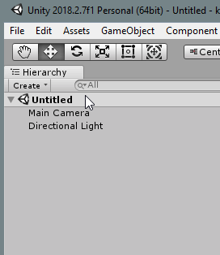
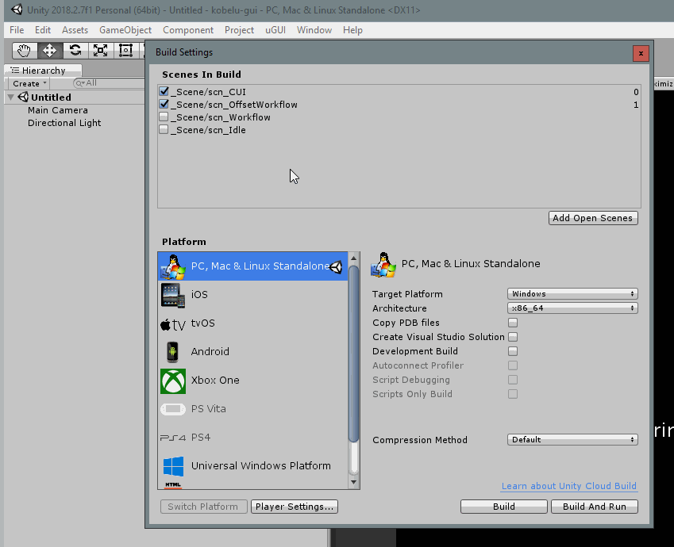

# Entwicklungseinstellungen

---

For the **English version** down below, please click [here](#english).

---

Dieses Dokument beschreibt die Einrichtung der incluMove GUI Anwendung zur aktiven Entwicklung mit Unity.

## Vorraussetzungen
* [Unity 2019.4 (am einfachsten über UnityHub)](https://store.unity.com/download?ref=personal)
* [Git](https://store.unity.com/download?ref=personal)
* [Github Account + ssh Key (für 3rd-Party Pakete)]()
* kompatible IDE (z. B. Visual Studio)

## Buildvorgang
Um die Applikation neu zu erstellen muss diese in Unity neu erstellt werden. Im geöffneten Unityprojekt kann das Projekt über *Datei > Buildeigenschaften* neu gebaut werden.\
\
In den Buildeinstellungen müssen nun die Szenen für den Build ausgewählt werden. Ausgewählt sein müssen *scn_CUI_single*, *scn_Bootstrapper* und *scn_WorkflowEditor*.\
\
Über den Build Button wird nach Wahl des Ausgabeordners der Buildprozess durchgeführt.\

_________________________________________________________________________________________________________________

# Development settings
This document describes how to set up the incluMove GUI application for active development with Unity.

## Prerequisites
* [Unity 2019.4 (easiest via UnityHub)](https://store.unity.com/download?ref=personal)
* [Git](https://store.unity.com/download?ref=personal)
* [Github account + ssh key (for 3rd party packages)]()
* compatible IDE (e.g. Visual Studio)

## Build process
To rebuild the application, it must be rebuilt in Unity. In the opened Unity project, the project can be rebuilt via *File > Build properties*.\
\
In the build settings, the scenes for the build must now be selected. The following must be selected: *scn_CUI_single*, *scn_Bootstrapper* and *scn_WorkflowEditor*.\
\
The build process is carried out via the build button after selecting the output folder.\

