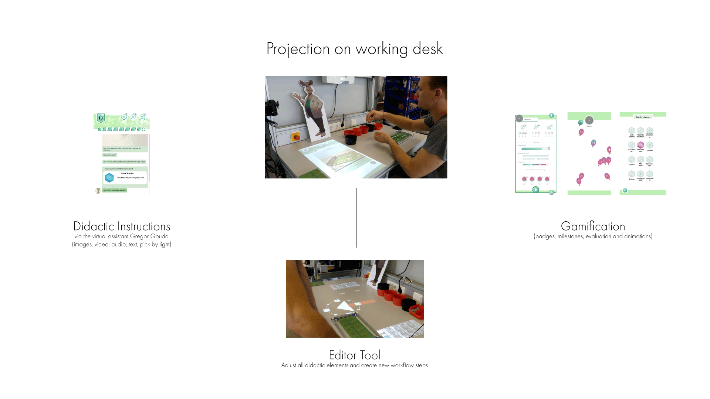

# incluMOVE-Software Dokumentation

---

For the **English version** down below, please click [here](#english).

---

Willkommen auf der **Dokumentationsseite der incluMOVE Anwendung**.  
Hier gibt es Informationen zu Einrichtung, Betrieb und Entwicklung der incluMOVE Unity Anwendung.  

Weiterführende Informationen:

 1. [Übersicht](#übersicht)
 2. [Gamification, virtueller Assistent, Chatbot](#gamification_de)
 3. [Software Pakete](#software_de)
 4. [MIT-Lizenz](#license_de)
 5. [Publikationen](#publications_de)
 6. [incluMOVE Graphics](#graphics_de)
 7. [Das incluMOVE Projekt](#project_de)
 8. [Kontakt](#contact_de)

---

## Übersicht
incluMOVE ist ein virtuelles Assistenzsystem, entwickelt für eine neurodivergente Nutzergruppe. Es erklärt neurodivergenten Nutzenden Arbeitsschritte mit Hilfe eines Chatbots, einem Pick-by-Light System und des virtuellen Assistenten Gregor Gouda. Gamification Elemente steigern die Motivation und bieten einen Leistungsvergleich. 

---

## Gamification, virtueller Assistent, Chatbot
incluMOVE kombiniert ein didaktisches User Interface mit Gamification Elementen. Genauere Beschreibungen zu den einzelnen Screens findet sich im Menüpunkt Anwendungsübersicht.
Eine Gesamtübersicht des User Interface sind in diesem Video erklärt.

https://www.youtube.com/watch?v=qUG8vzNHk2M 

#### Chatbot
Der Chatbot begleitet Nutzende durch die einzelnen Arbeitsschritte. Diese Arbeitsschritte sind frei editierbar (Editor Tool) und es können Text, Audio, Bilder und Videos eingebunden werden, um die einzelnen Schritte zu erklären. 
#### Gregor Gouda
Der virtuelle Assistent Gregor Gouda ist Teil des Chatbots und übernimmt die Rolle des Erklärenden der Arbeitsschritte. Zusätzlich sind Animationen wie z. B. Begrüßung und Abschied eingebaut.
#### Zeitleiste
Eine Zeitleiste im Chatbot selbst gibt Aufschluss darüber, in welchem Arbeitsschritt man sich gerade befindet und ob man in der Zeit liegt. Zusätzlich gibt es eine Zähler Anzeige, wie viele Durchläufe man bereits absolviert hat.
#### Gamification
Jede Session können Nutzende sogenannte Abzeichen sammeln, die ihre Schnelligkeit, Ausdauer und Leistung wieder spiegeln. Diese Abzeichen bieten Nutzenden eine Möglichkeit, eine Übersicht über ihre Leistung zu erhalten und werden am Ende der Session in eine bunte Belohungsanimation eingelöst. 
Über einen längeren Zeitraum erhalten Nutzende sogannte Meilensteine, die iteratives Arbeiten mit incluMOVE belohnen.
Animationen sind ein wichtiger Bestandteil der User Interface Experience. Bei jedem Abschluss eines Workflows sowie beim Sammeln von Abzeichen werden besondere Animationen abgespielt. Auch in der Leistungsübersicht gegen Ende sind Animationen eingebaut. 
#### Editor Tool
Das Editor Tool bietet die Möglichkeit, alle Anzeigen im Chatbot (Bild, Text, Ton, Video), Pick-By-Light Projektionen und die Zeit eines Arbeitsschrittes zu gestalten und neue Einträge hinzuzufügen. 
Zusätzlich kann die Adaptivität eines jeden Elements editiert werden, um zusätzliche Hilfsangebote bei Bedarf anzuzeigen. 

---

## Software Pakete
Der Software Code ist in zwei verschiedenen Paketen verfügbar.

#### incluMOVE Light
incluMOVE Light ist die **Basis Edition des Assistenzsystems**. Es beinhaltet alle Funktionen und User Interface Elemente, die im Projekt entwickelt wurden. 
Für die Verwendung wird nur ein *PC, eine Tischoberfläche für die Projektion und ein Beamer* benötigt.

#### incluMOVE Extended
incluMOVE Extended ist die work-in-progress Version des incluMOVE Projektes und bietet zusätzlich Kommunikationsschnittstellen zu Hardware Komponenten des Fraunhofer IPA wie die Bestückungshilfe und den Bestückungstisch.  
*Wir empfehlen die incluMOVE Extended Version für eine Weiterentwicklung des Forschungsansatzes des incluMOVE Projektes.*

---

## MIT-Lizenz

Der incluMOVE Software Code steht unter der **MIT-Lizenz**. 
Nähere Informationen finden sich dazu [hier](LICENSE.md).

Die **incluMOVE Software**, ihr User Interface Design und die Gamification Konzepte wurden vom Projektpartner **[Affective & Cognitive Institute](https://aci.hs-offenburg.de/)** der [Hochschule Offenburg](https://www.hs-offenburg.de/) entwickelt. 

Folgende Mitarbeiter des ACI haben an der incluMOVE Software gearbeitet:

**Konzept:** Moritz Umfahrer, Jonas Grund, Lea Buchweitz  
**Design:** Jonas Grund  
**Programmierung:** Moritz Umfahrer, James Gay, Hubert Njuacha  
**Leitung:** Prof. Dr. Oliver Korn  

Wir danken unseren Partnern **Femos gGmbH** für ihr Feedback und die Nutzerstudien vor Ort, sowie **Fraunhofer IPA** für die Entwicklung der Objekterkennung und den Hardware-Komponenten der *incluMOVE Extended* Version!

---

## Publikationen 
Folgende wissenschaftliche Beiträge sind im Projekt entstanden:

> Grund J., Umfahrer M., Buchweitz L., Gay J., Theil A., and Korn O. (2020)  
> *A gamified and adaptive learning system for neurodivergent workers in electronic assembling tasks. In Proceedings of the Conference on Mensch und Computer*  
> (MuC ’20). Association for Computing Machinery, New York, NY, USA, 491–494.  
> https://doi.org/10.1145/3404983.3410420  

---

## incluMOVE Graphics
**Der virtuelle Assistent Gregor Gouda** steht auch unter der *CC-BY-SA Lizenz* zur freien Nutzung zur Verfügung. Dieses Paket enthält zusätzliche **Designs, Hintergründe und Animationen**. 

> https://github.com/AffectiveCognitiveInstitute/inclumove_graphics

---

## Das incluMOVE Projekt
**incluMOVE** war ein Kollaborationsprojekt mit dem Inklusionsbetrieb **[Femos gGmbH](https://www.femos-zenit.de/de/)**, dem Forschungsinstitut **[Fraunhofer IPA](https://www.ipa.fraunhofer.de/)** und dem **[Affective & Cognitive Institut der Hochschule Offenburg](https://aci.hs-offenburg.de/de/)**.  
Es endete im März 2021.

Für mehr Informationen besuchen Sie bitte die offizielle Webseite des Projektes: 
> **[incluMOVE.de](http://inclumove.de/)**.

Das incluMOVE Projekt wurde gefördert von:

---

## Kontakt

Bei weiteren Fragen zu dem incluMOVE Software Code, kontaktieren Sie bitte unsere Ansprechpartner des ACI:  
> https://aci.hs-offenburg.de/contact/  

Für Projekt bezogene Fragen kontaktieren Sie bitte die Projektleitung des incluMOVE Projektes.  

> http://inclumove.de/kontakt/

_________________________________________________________________________________________________________________

# incluMOVE software documentation (English)

Welcome to the **Documentation page of the incluMOVE application**.  
This is where you can find information on setting up, operating and developing the incluMOVE Unity application.  

Further information:

 1. [Overview](#overview)
 2. [Gamification, virtual assistant, chatbot](#gamification_en)
 3. [Software packages](#software_en)
 4. [MIT licence](#license_en)
 5. [Publications](#publications_en)
 6. [incluMOVE Graphics](#graphics_en)
 7. [The incluMOVE Project](#project_en)
 8. [Contact](#contact_en)

---

## Overview
incluMOVE is a virtual assistance system developed for a neurodivergent user group. It explains work steps to neurodivergent users with the help of a chatbot, a pick-by-light system and the virtual assistant Gregor Gouda. Gamification elements increase motivation and offer a performance comparison. 

---

## Gamification, virtual assistant, chatbot
incluMOVE combines a didactic user interface with gamification elements. More detailed descriptions of the individual screens can be found in the menu item Application Overview.
A general overview of the user interface is explained in this video.

https://www.youtube.com/watch?v=qUG8vzNHk2M 

#### Chatbot
The chatbot accompanies users through the individual work steps. These steps are freely editable (Editor Tool) and text, audio, images and videos can be integrated to explain the individual steps. 
#### Gregor Gouda
The virtual assistant Gregor Gouda is part of the chatbot and takes on the role of explaining the work steps. In addition, animations such as greetings and farewells are incorporated.
#### Timeline
A timeline in the chatbot itself provides information about which work step you are currently in and whether you are on time. In addition, there is a counter displaying how many rounds you have already completed.
#### Gamification
Each session, users can collect so-called badges that reflect their speed, endurance and performance. These badges offer users a way to keep track of their performance and are redeemed at the end of the session into a colourful reward animation. 
Over a longer period of time, users receive so-called milestones that reward iterative work with incluMOVE.
Animations are an important part of the user interface experience. Special animations are played every time a workflow is completed or badges are collected. Animations are also built into the performance overview towards the end. 
#### Editor Tool
The Editor Tool offers the possibility to design all displays in the chatbot (image, text, sound, video), pick-by-light projections and the time of a workflow step and to add new entries. 
In addition, the adaptivity of each element can be edited to display additional assistance if needed. 

---

## Software packages
The software code is available in two different packages.

#### incluMOVE Light
incluMOVE Light is the **Basic Edition of the assistance system**. It contains all functions and user interface elements developed in the project. 
Only a *PC, a table surface for projection and a beamer* are required for use.

#### incluMOVE Extended
incluMOVE Extended is the work-in-progress version of the incluMOVE project and offers additional communication interfaces to hardware components of the Fraunhofer IPA such as the placement aid and the placement table.  
*We recommend the incluMOVE Extended version for further development of the research approach of the incluMOVE project.

---

## MIT licence

The incluMOVE software code is licensed under the **MIT licence**. 
More information can be found [here](LICENSE.md).

The **incluMOVE software**, its user interface design and the gamification concepts were developed by the project partner **[Affective & Cognitive Institute](https://aci.hs-offenburg.de/)** of the [Offenburg University of Applied Sciences](https://www.hs-offenburg.de/). 

The following ACI staff members worked on the incluMOVE software:

**Concept:** Moritz Umfahrer, Jonas Grund, Lea Buchweitz  
**Design:** Jonas Grund  
**Programming:** Moritz Umfahrer, James Gay, Hubert Njuacha  
**Direction:** Prof. Dr. Oliver Korn  

We would like to thank our partners **Femos gGmbH** for their feedback and on-site user studies, as well as **Fraunhofer IPA** for developing the object recognition and hardware components of the *incluMOVE Extended* version!

---

## Publications 
The following scientific contributions have been produced in the project:

> Grund J., Umfahrer M., Buchweitz L., Gay J., Theil A., and Korn O. (2020)  
> A gamified and adaptive learning system for neurodivergent workers in electronic assembling tasks. In Proceedings of the Conference on Mensch und Computer*  .
> (MuC '20). Association for Computing Machinery, New York, NY, USA, 491-494.  
> https://doi.org/10.1145/3404983.3410420  

---

## incluMOVE Graphics
**The virtual assistant Gregor Gouda** is also available for free use under the *CC-BY-SA licence*. This package includes additional **designs, backgrounds and animations**. 

> https://github.com/AffectiveCognitiveInstitute/inclumove_graphics

---

## The incluMOVE project
**incluMOVE** was a collaboration project with the inclusion company **[Femos gGmbH](https://www.femos-zenit.de/de/)**, the research institute **[Fraunhofer IPA](https://www.ipa.fraunhofer.de/)** and the **[Affective & Cognitive Institute of the University of Applied Sciences Offenburg](https://aci.hs-offenburg.de/de/)**.  
It ended in March 2021.

For more information, please visit the project's official website: 
**[incluMOVE.de](http://inclumove.de/)**.

The incluMOVE project was funded by:

---

## Contact

For further questions about the incluMOVE software code, please contact our ACI contacts:  
> https://aci.hs-offenburg.de/contact/  

For project related questions, please contact the incluMOVE project management.  

> http://inclumove.de/kontakt/
